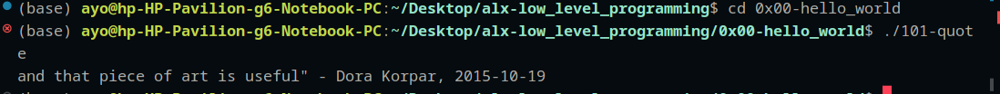

This directory contains Alx first week C's projects

## 0x00-hello-world C Task Code Explanations

## Print functions in C
### Task 04 Puts.c

```c
#include <stdio.h> /*The header file*/
/**
 * main - Prints out the passed strings in double quotes
 * puts function is used to print out the string to
 * the stdout i.e to display the arrays of chars passed as an argument
 * for the puts function
 * Return: All good
 */
int main(void)
{
    puts("\"Programming is like building a multilingual puzzle");
    return (0);
}
```
The header file hash include stdio.h is required to to call the standard input and output function puts
mostly required for all c programs. The strings encapsulated inside the first comment block 
is used to describe the main function which includes what it does and what its returns as part of betty code style requirements.
The int in the function definition is the data type of the funtion and the main is by convention the main body of any program, think of it as a container for your c algorithms.
The void parameter passed literally means nothing that is null, meaning the algorithms inside the main 
doesn't actually return anything as a value rather it just print out the result to the stdout.
returns 0 means all went well and nothing was returned.

### 5-printf
```c
#include <stdio.h>

/**
 * main - Prints out strings
 * printf is a function that prints out strings to
 * stdout
 * Return: All good
 */

int main(void)
{
	printf("with proper grammar, but the outcome is a piece of art,\n");
	return (0);
}
```
printf is also a function in the stdio library the prints out arrays of characters or strings to the standard output.

## Data Types in C
### 6-size

#### input
```c
#include <stdio.h>

/**
 * main - Prints out the size of c datatypes
 * Return: All good
 */

int main(void)
{
	printf("Size of a char: %li byte(s)\n", sizeof(char));
	printf("Size of an int: %li byte(s)\n", sizeof(int));
	printf("Size of a long int: %li byte(s)\n", sizeof(long int));
	printf("Size of a long long int: %li byte(s)\n", sizeof(long long int));
	printf("Size of a float: %li byte(s)\n", sizeof(float));
	return (0);
}
```
sizeof is a function used to get the size of arguments passed in bytes, so because the return data type for the sizeof is long int %li is used as a place holder which is a format code to display the result as part of the srings in double quotation inside the printf function
Note! you can use %d for the format code too

#### Output
```comandline
Size of a char: 1 byte(s)
Size of an int: 4 byte(s)
Size of a long int: 8 byte(s)
Size of a long long int: 8 byte(s)
Size of a float: 4 byte(s)
```

Note!
* You should get something like this as an output which are the sizes of the built in data types in C
>- Size of a char: 1 byte(s) which is 8 bits i.e 2^8 which 256base 10 and if converted shouldn't be more than 8 1s and 0s, example is letter a with ASCII decimal 65, try converting the 65base10 to binary
>- Size of an int: 4 byte(s) which is 32 bits i.e 2^32 which is roughly 4billion and that is shared between the positive and negative integers, thus the computer can only give output on data type int between -2^31 and +2^31
>- Size of a long int: 8 byte(s) this is of size 8 bytes that is 64 bit, you can think of this as an enhanced int which you can use when you want to write a c program that will eventually with big whole numbers
>- Size of a long long int: 8 byte(s) same as long int 
>- Size of a float: 4 byte(s) float is a real number that is numbers that has decimal point example 12.234, the size of this data type is 32 bits or 4 bytes, so you might want to check other data type for real if you want to get more precision for your floating numbers

### Other Data Types 
>- double (enhanced floats)
>- bool (booleans:True/False)
>- string (arrays of chars)
>- unsigned int 

### 101-qoute
```c
#include <stdio.h>
#include <unistd.h>
/**
 * main - main block
 * Return: 1 do not go well
 */
int main(void)
{

	write(2, "and that piece of art is useful\" - Dora Korpar, 2015-10-19\n",
		  59);
	return (1);
}
```
write() function is a stdio and stderr function to print out strings to stderr or stdout, it takes 3 arguments
file descriptor, the strings or arrays of characters and the total number of character in bytes,
since one char is 1 byte, the nbytes here is 59, if you count the chars inside the double
quote you should have 59.
You can get the nbytes programmatically by calling the strlen on the double quoted string
from string.h library by #including its header file.
Though its returns 1 which means all doesn't doesn't go well, the input was printed because of the file
desciptor argument 2 that was passed sent the input string to stderr.

### Output
```commandline
and that piece of art is useful" - Dora Korpar, 2015-10-19
```


from the image did you notice anything before the base in bracket (base)?, if yes great, if great to 
but there is something to actually notice which is the blue filled dot and circled cancel sign.
The blue means all goes well and the input gets printed to stdout while the cancel means although all my progams ran without any actual errors but all didn't go well because my program returns 1 as it return type which signifies good error/or acceptable error and my strings is sent to the stderr.